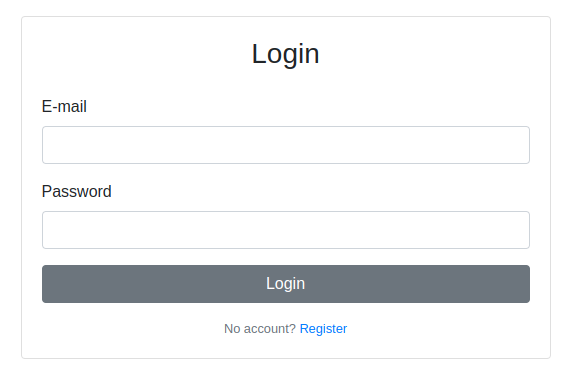

# Remrob application setup

## Pre-requisites

- Server running Ubuntu 20.04 or 24.04
- Ansible >=2.16
    ```bash
    sudo apt install ansible
    ```

| OS  | Supported ROS containers |
|---|---|
| Ubuntu 20.04 Focal Fossa  | ROS Noetic  |
| Ubuntu 24.04 Noble Numbat  | ROS Noetic<br>ROS2 Jazzy   |

## Installation with Ansible

### Step 1: run the install script

```bash
# requires sudo privileges
bash ./install.sh
```

The install script will prompt for the DB password, and JWT secret key.
The source code will be placed in `$HOME/remrob-app`.

### Step 2: setup of Docker images

If Docker was not installed prior to starting installation, then the playbook in previous step will have installed it.
However, in scenario where this happens please do a system restart so that the user the ansible script was run as gets properly evaluated as part of the docker user group and the script below runs successfully.

1. Run remrob-docker ansible playbook

    ```bash
    ansible-playbook ansible/install.yaml --tags remrob-docker
    ```

2. Run image build script

    **ROS1 Noetic:**
    ```bash
    bash ./image-build.sh --target noetic
    ```

    **ROS2 Jazzy:**
    ```bash
    bash ./image-build.sh --target jazzy
    ```

## Ubuntu 24.04 additional steps

For successfully starting systemd containers disable unified cgroup architecture in grub boot loader (restart to take effect).

```
# /etc/default/grub
# GRUB_CMDLINE_LINUX_DEFAULT="quiet splash systemd.unified_cgroup_hierarchy=0"

sudo update-grub
```

---

The app will be available at `http://127.0.0.1` after the installation is complete 🚀

Default user email: **admin**

Default user password: **admin**




## Plugging in robots

Instructions on how to add physical robots to the Remrob system are available at [robots/README.md](./robots/README.md)

## (optional) Hardware acceleration

For running hardware accelerated containers, see [NVIDIA_HWA.md](./NVIDIA_HWA.md)

## (optional) Inotify instances

Higher container load (9+ simultaneous containers) can cause [overstepping of inotify limits](https://bugzilla.proxmox.com/show_bug.cgi?id=1042) leading to new containers being unable to start.

To support high container load on the server change default inotify settings in `/etc/sysctl.conf`.

```
# Example of increased default limits

fs.inotify.max_user_watches=131072
fs.inotify.max_user_instances=1024
```

# Application structure


There are three main services to the Remrob application:
- remrob-server (the container orchestrating backend)
- remrob-webapp (the frontend app + Flask booking server)
- remrob-docker (Docker image build files)

Here are listed ports in use by the Remrob app (make sure there are no conflicts).

| Port | Application |
|:--------| :-------------|
| 80 | nginx HTTP |
| 5000 | Frontend server & Flask API |
| 5432 | PostgreSQL server |
| 5901-5909 | Container VNC ports mapped to host |
| 6085 | Websockify |
| 9000 | Node Container API |

### Checking service status/logs

**remrob-server**

```bash
pm2 status remrob
```

**remrob-webapp**
```bash
journalctl -e -u remrob-flask.service
```

**websockify**
```bash
journalctl -e -u websockify.service
```