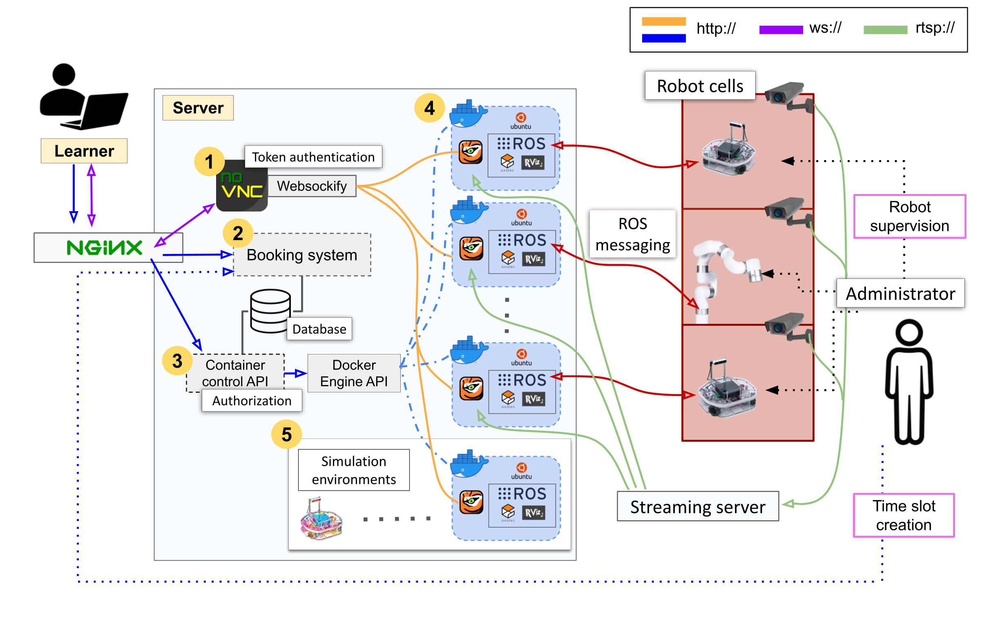

# Pre-requisites

- Server running Ubuntu 20.04 or 24.04
- Ansible >=2.16
    ```bash
    sudo apt install ansible
    ```

| OS  | Supported ROS containers |
|---|---|
| Ubuntu 20.04 Focal Fossa  | ROS Noetic  |
| Ubuntu 24.04 Noble Numbat  | ROS Noetic<br>ROS2 Jazzy   |

## Installation with Ansible

### Step 1: run the install script

```bash
bash ./install.sh
```

The install script will prompt for the DB password, and JWT secret key.
The source code will be placed in $HOME/remrob-app.

### Step 2: setup of Docker images

If Docker was not installed prior to starting installation, then the playbook in previous step will have installed it.
However, in scenario where this happens please do a system restart so that the user the ansible script was run as gets properly evaluated as part of the docker user group and the script below runs successfully.

### Run remrob-docker ansible playbook

```bash
ansible-playbook ansible/install.yaml --tags remrob-docker
```

### Run image build script

**ROS1 Noetic**
```bash
bash ./image-build.sh --target noetic
```

**ROS2 Noetic**
```bash
bash ./image-build.sh --target jazzy
```

## Ubuntu 24.04 additional steps

Disable unified cgroup architecture in grub boot loader (restart to take effect).
```
# /etc/default/grub
# GRUB_CMDLINE_LINUX_DEFAULT="quiet splash systemd.unified_cgroup_hierarchy=0"

sudo update-grub
```

## Plugging in robots

Instructions on how to add physical robots to the Remrob system are available at [robots/README.md](./robots/README.md)

# (optional) Hardware accelerated containers

## Pre-requisites

| OS  |  Cuda version  | NVidia driver version  |
|---|---|---|
| 20.04  | 11.4.2  | **>=470** |
| 24.04  | 12.6.3  | **>=560** |

## Setup

1. Install nvidia-ctk toolkit

    ```
    sudo apt install nvidia-container-toolkit
    ```

2. Configure for Docker

    ```
    sudo nvidia-ctk runtime configure --runtime=docker
    sudo systemctl restart docker
    ```

### Ubuntu 24.04 additional steps

1. Since the VirtualGL setup does not work with Wayland (the default display server for 24.04) need to disable it to force Xorg (restart to take effect).

    ```
    #/etc/gdm3/custom.conf

    WaylandEnable=false
    ```

2. Enable xhost access for Docker:

    ```
    xhost +local:docker
    ```

## Running hardware accelerated containers

1. Build hardware accelerated image versions

    ```bash
    bash ./image-build.sh --target <noetic|jazzy> --nvidia
    ```

2. Rebuild docker compose templates to use hardware-accelerated image versions

    ```bash
	cd remrob-app/remrob-server/compose && python compose_generator.py --nvidia
	```

By default will use X1 display socket for VirtualGL rendering, but if your system uses a different one, then it can be specified with the `--xsocket` flag. e.g.

```bash
python compose_generator.py --nvidia --xsocket X0
```

In Remrob app the hardware-accelerate image versions will automatically take precedence over the base versions (see `remrob-app/remrob-server/config/default.json`)

# (optional) Inotify instances

All Remrob containers share the host's cgroup as it is required to run `systemd` within them. Sometimes this may cause overstepping of inotify limits leading to new containers being unable to start.

To support high container load on the server change default inotify settings in `/etc/sysctl.conf`.

```
# Example of increased default limits

fs.inotify.max_user_watches=131072
fs.inotify.max_user_instances=1024
```

# Application structure



There are three main services to the Remrob application:
- remrob-server (the container orchestrating backend)
- remrob-webapp (the frontend app + Flask booking server)
- remrob-docker (Docker image build files)

Here are listed ports in use by the Remrob app (make sure there are no conflicts).

| Port | Application |
|:--------| :-------------|
| 80 | nginx HTTP |
| 5000 | Frontend server & Flask API |
| 5432 | PostgreSQL server |
| 5901-5909 | Container VNC ports mapped to host |
| 6085 | Websockify |
| 9000 | Node Container API |

## Checking service status/logs

### remrob-server

```bash
pm2 status remrob
```

### remrob-webapp
```bash
journalctl -e -u remrob-flask.service
```

### websockify
```bash
journalctl -e -u websockify.service
```