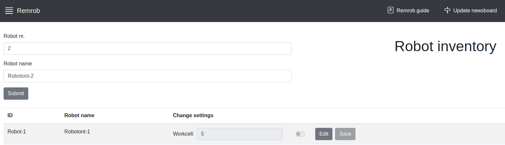

# Adding physical robots to the application

There are two parts to cover when adding phsyical robots to the application.
Firstly, the robot(s) must be connected to the same network the server is running on. Secondly, the containers must be connected to the same robot LAN (this is achieved with the Docker macvlan driver).

## Step 1: Connect robots to the server network

Ideally the robots get reserved IP addresses on the server network. Consider setting up DHCP reservation on the router.

## Step 2: Modify server config to recognize the robot

ROS1 and ROS2 have different requirements for connecting to the robot.

### ROS 1

1. Add the robot IP address to `remrob-server/compose/config/config-macvlan.yaml`

	```yaml
	# Example
	- name: robo-2 # reserved container name (do not modify)
	  master_name: robotont-2 # robot hostname
	  self_ip: 192.168.200.102 # container IP address
	  master_ip: 192.168.200.2 # robot IP address
	```

2. Regenerate Docker Compose templates

	```bash
	cd remrob-server/compose && python compose_generator.py
	```

3. On the robot, add the container hostname to the `/etc/hosts` file:

	```bash
	192.168.200.102 robo-2
	```

### ROS 2

Since ROS 2 uses DDS, the robot IP address is not needed. The robot will automatically be discoverable on the DDS network as long as it is on the same network as the server.
The only step needed is to ensure that the robot has the same $ROS_DOMAIN_ID as the container. By default every container robo-{x} will have a matching ROS_DOMAIN_ID of {x} (e.g. robo-2 will have ROS_DOMAIN_ID=2).

This can be overriden in `remrob-server/compose/config/config-macvlan.yaml`:

```yaml
# Example
- name: robo-2 # reserved container name (do not modify)
  ros_domain_id: 3
```

Run `compose_generator.py` for changes to take effect.

## Step 3: Hooking up containers to the robot LAN

1. Create the Docker macvlan network

	```bash
	docker network create \
		-d macvlan \
		-o parent={eth_interface} \
		--gateway={router gateway} \
		--subnet={router subnet} \
		--ip-range={container-reserved subnet} \
		remrob

	## Example
	docker network create \
		-d macvlan \
		-o parent=enp46s0 \
		--gateway=192.168.200.1 \
		--subnet=192.168.200.0/24 \
		--ip-range=192.168.200.96/27 \
		remrob
	```

2. Change websockify VNC server IP addresses in `remrob-server/websockify-token.cfg` to match the container-reserved subnet (by default uses 192.168.200.0/24 subnet)

	```bash
	# example
	robo-2: 192.168.200.102:5902
	```

3. For the containers to be accessible from the host (for the purposes of proxying VNC connections), a [proxying macvlan interface must be created](https://blog.oddbit.com/post/2018-03-12-using-docker-macvlan-networks/).

	```bash
	ip link add remrob_bridge link {eth_interface} type macvlan mode bridge
	ip addr add {bridge_ip} dev remrob_bridge
	ip link set remrob_bridge up
	ip route add {container-reserved subnet} dev remrob_bridge

	## Example
	ip link add remrob_bridge link enp46s0 type macvlan mode bridge
	ip addr add 192.168.200.199/32 dev remrob_bridge # .199 is not special, can be set to anything free within the subnet
	ip link set remrob_bridge up
	ip route add 192.168.200.96/27 dev remrob_bridge
	```

### Make the remrob_bridge proxy persistent

To make the remrob_bridge in step 3.3 persist across reboots, create a systemd service that initializes it.

1. Copy the script to `/usr/local/bin` (change the variables in the script to suit your system) and make it executable:

	```bash
	sudo cp macvlan_link.sh /usr/local/bin
	sudo chmod +x /usr/local/bin/macvlan_link.sh
	```

2. Enable the systemd service:

	```bash
	sudo cp remrob-bridge.service /etc/systemd/system
	sudo systemctl enable remrob-bridge
	sudo systemctl start remrob-bridge
	```

## Step 4: Add the robots to the database:

For making the robot containers available on the frontend application they need to be stored in "inventory" table in the database.

These can be managed via the frontend application:




